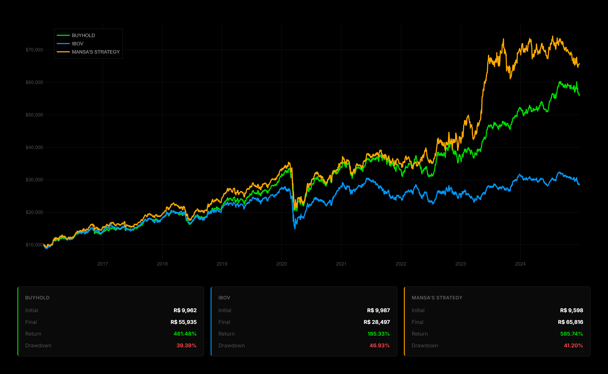
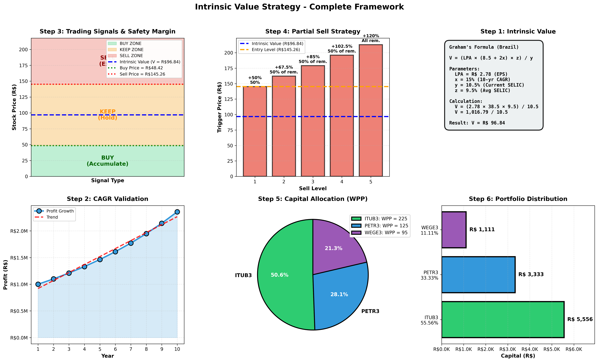

# Intrinsic Value Strategy

A repository dedicated to applying Graham's intrinsic value strategy along with the picking of growing profits stocks (10 years Liquid Profits CAGR) to provide a higher return over the usual Buy & Hold strategies, being one of the key features of this project.

Built for the [Mansa](https://github.com/mansa-team) project and designed for the automated wallet management system that will help the user with Buy & Hold strategies, maximizing their returns.

## Results



### Configuration

1. Create `.env` file:
```env
STOCKSAPI_HOST=localhost
STOCKSAPI_PORT=3200

STOCKSAPI_PRIVATE.KEY=your_api_key_here
```

2. Edit portfolio in `src/__init__.py`:
```python
Portfolio = [
    {'TICKER': 'ITUB3', 'WEIGHT': 90},
    {'TICKER': 'PETR3', 'WEIGHT': 88},
    {'TICKER': 'WEGE3', 'WEIGHT': 87},
    # Add more stocks...
]
```

3. Configure backtest:
```python
config = {
    'SAFETY_MARGIN': 0.50,        # 50% margin
    'INITIAL_CAPITAL': 10000,     # R$ 10,000
    'START_DATE': '2016-01-01',
    'END_DATE': '2024-12-31',
}
```

### Run

```bash
python __init__.py
```

## Trading Strategy

### Step 1: Calculate Intrinsic Value

**Graham's Formula (adapted for Brazil):**

$$V = \frac{\text{LPA} \times (8.5 + 2x) \times z}{y}$$

Where:
- **V** = Intrinsic Value (R$)
- **LPA** = Earnings Per Share (R$)
- **x** = 10-year Liquid Profits CAGR (%)
- **y** = Current SELIC Rate (%)
- **z** = Average SELIC Rate over the period of 10 years average (%)

**Why these components?**

| Component | Meaning | Impact on Valuation |
|-----------|---------|-------------------|
| LPA | Current earnings per share | Higher earnings = Higher value |
| 8.5 | Base P/L for 0% growth stocks | Baseline multiplier for earnings |
| 2x | Growth premium (1% growth = +2 P/L points) | Higher growth = Exponentially higher value |
| y | Current interest rate (SELIC) | Higher rates = Lower valuations (inverse relationship) |
| z | Average SELIC rate over 10 years | Historical rate baseline for long-term valuation |

**Example:**

```
LPA = R$ 2.78
x = 15% (CAGR)
y = 10.5% (Current SELIC)
z = 9.5% (10-year Average SELIC)

V = (2.78 × (8.5 + 2×15) × 9.5) / 10.5
V = (2.78 × 38.5 × 9.5) / 10.5
V = 1,016.79 / 10.5
V = R$ 96.84

STOCK A INTRINSIC VALUE = R$ 96.84
```

### Step 2: Validate Growth (10-Year CAGR)

Only stocks with consistent profit growth over 10 years are eligible.

$$\text{CAGR} = \left(\frac{\text{Profit}_{\text{Year 10}}}{\text{Profit}_{\text{Year 1}}}\right)^{\frac{1}{10}} - 1$$

**Requirements:**
- At least 10 years of data
- No negative profit years
- Consistent upward trend

**Example:**
```
Year 1 Profit:  R$ 1,000,000
Year 10 Profit: R$ 2,593,742

CAGR = (2,593,742 / 1,000,000)^(1/10) - 1
CAGR = 10%
```

### Step 3: Generate Trading Signals

Use **Safety Margin** to define entry and exit zones:

$$\text{Buy Price} = V \times (1 - m)$$
$$\text{Sell Price} = V \times (1 + m)$$

Where **m** = Safety Margin (default: 50%)

**Example (continuing above):**
```
V = R$ 96.84
m = 0.50 (50%)

Buy Price = 96.84 × (1 - 0.50) = R$ 48.42
Sell Price = 96.84 × (1 + 0.50) = R$ 145.26
```

### Signal Zones

```
Price Scale:

R$ 145.26  ├─────────────────────────────────
           │  SELL ZONE (Full Exit)
           │
R$ 96.84   ├─────────────────────────────────
           │  INTRINSIC VALUE
           │
R$ 48.42   ├─────────────────────────────────
           │  BUY ZONE (Accumulate)
```

### Signal Rules

```
If Current_Price <= Buy_Price:
    Signal = BUY
    
If Buy_Price < Current_Price < Sell_Price:
    Signal = KEEP
    
If Current_Price >= Sell_Price:
    Signal = SELL
```

### Step 4: Partial Sell Strategy

For every 17.5% increase above the 50% safety margin, sell 50% of position, logarithmically.

**Sell Levels:**

| Level | Trigger Price | Profit Margin | Action |
|-------|---------------|---------------|--------|
| 1 | V × 1.50 | +50% | Sell 50% |
| 2 | V × 1.675 | +67.5% | Sell 50% of remaining |
| 3 | V × 1.85 | +85% | Sell 50% of remaining |
| 4 | V × 2.025 | +102.5% | Sell 50% of remaining |
| 5 | V × 2.20 | +120% | Sell remaining |

**Rebalancing Priority:**

The system prioritizes selling stocks that exceed their target Strategic Weight allocation:

$$\text{Current Weight}_i = \frac{\text{Position Value}_i}{\text{Total Portfolio Value}} \times 100\%$$

$$\text{Excess Weight}_i = \max\left(\text{Current Weight}_i - \frac{\text{SW}_i}{\sum \text{SW}} \times 100, 0\right)\%$$

If $\text{Excess Weight}_i > 0$, the stock receives higher selling priority at each partial sell trigger.

**Example:**

```
V = R$ 96.84
Initial position: 1,000 shares (Stock A)
Portfolio SW allocation target: 90% (Stock A), 10% (Stock B)
Current portfolio value: R$ 100,000
Current allocation: Stock A = 95%, Stock B = 5%

Excess Weight_A = 95% - 90% = 5% overweight

Level 1: Price = R$ 145.26
  Stock A is overweight by 5%, gets priority for selling
  Sell 500 shares to rebalance toward 90% target

Level 2: Price = R$ 171.31
  Rebalancing adjusted allocation closer to target
  Sell remaining shares based on level 2 trigger
  
Result: Profits locked while maintaining target portfolio allocation
```

## Capital Allocation

### Weighted Purchase Price (WPP)

Allocate capital based on how undervalued each stock is, weighted by its Strategic Weight (SW):

$$\text{WPP}_i = \frac{\text{IV}_i}{\text{Price}_i} \times \text{SW}_i$$

Where:
- **IV** = Intrinsic Value
- **Price** = Current Market Price
- **SW** = Strategic Weight (range: 1-100)

The Strategic Weight (SW) represents how important a stock is to your portfolio strategy. Higher SW values indicate stocks you want to prioritize for capital allocation.

**Example (2 stocks, using Strategic Weights):**

```
Stock A (continuing from Step 1):
  IV = R$ 96.84, Current Price = R$ 40, SW = 90
  Discount Factor = 96.84 / 40 = 2.42x
  WPP_A = 2.42 × 90 = 217.8

Stock B:
  IV = R$ 60, Current Price = R$ 30, SW = 50
  Discount Factor = 60 / 30 = 2.0x
  WPP_B = 2.0 × 50 = 100
```

### Proportional Capital Distribution (PCD)

Determine what % of total capital each stock gets:

$$\text{PCD}_i = \frac{\text{WPP}_i}{\sum \text{WPP}} \times 100\%$$

$$\text{Capital Allocated}_i = \text{PCD}_i \times \text{Total Capital}$$

**Example (continuing above, R$ 10,000 total):**
```
Stock A: WPP_A = 217.8, PCD = (217.8 / 317.8) × 100% = 68.55%
         Capital = R$ 6,855

Stock B: WPP_B = 100, PCD = (100 / 317.8) × 100% = 31.45%
         Capital = R$ 3,145
```

### Shares to Buy

$$\text{Shares} = \left\lfloor \frac{\text{Allocated Capital}}{\text{Current Price}} \right\rfloor$$

**Example (continuing above):**
```
Stock A: floor(6,855 / 40) = 171 shares
Stock B: floor(3,145 / 30) = 104 shares
```

## Capital Liquidation

### Weighted Sell Factor (WSF)

The algorithm calculates a factor to determine liquidation priority. If the whole portfolio is undervalued, it triggers an "emergency" quadratic scaling to protect deep-value assets.

$$\text{WSF}_i = \left(\frac{\text{Price}_i}{V_i}\right)^k \times \frac{100}{\text{SW}_i}$$

Where the exponent $k$ is determined by the portfolio state:

$$k = \begin{cases} 
1, & \text{if } \text{Price}_i \ge V_i \text{ (Standard Overvaluation)} \\ 
2, & \text{if } \text{Price}_i < V_i \text{ (Emergency Protection)} 
\end{cases}$$

**Logic Components:**

| Component | Meaning | Impact |
|-----------|---------|--------|
| $k=1$ | Linear Exit | Standard profit taking proportional to overvaluation. |
| $k=2$ | Quadratic Shield | Squaring a ratio $<1$ makes it much smaller, shielding undervalued stocks. |
| $\frac{100}{\text{SW}}$ | Strategic Inverse | Lower Strategic Weight makes the stock more likely to be sold. |

**Example:**

```
Stock A: Price = 145.26 (at Level 1 partial sell), V = 96.84, SW = 90
  Price/V = 145.26/96.84 = 1.50 (overvalued)
  k = 1 (Standard Overvaluation)
  WSF_A = (1.50)^1 × (100/90) = 1.50 × 1.11 = 1.67

Stock B: Price = 40 (remains undervalued), V = 60, SW = 50
  Price/V = 40/60 = 0.67 (undervalued)
  k = 2 (Emergency Protection)
  WSF_B = (0.67)^2 × (100/50) = 0.45 × 2.00 = 0.90

Result: Stock A's overvaluation triggers higher liquidation priority.
        Stock B's quadratic protection (k=2) shields it from aggressive selling.
```

### Proportional Liquidation Distribution (PLD)

Determine how much of the cash target is requested from each stock:

$$\text{PLD}_i = \frac{\text{WSF}_i}{\sum \text{WSF}} \times 100\%$$

$$\text{Shares to Sell}_i = \left\lceil \frac{\text{PLD}_i \times \text{Target Cash}}{\text{Price}_i} \right\rceil$$

**Example (continuing above, Target Cash: R$ 5,000):**

```
Total WSF = 1.67 + 0.90 = 2.57

Stock A: PLD_A = (1.67 / 2.57) × 100% = 64.98%
         Target Cash = 64.98% × 5,000 = R$ 3,249
         Shares to Sell = ceil(3,249 / 145.26) = 23 shares

Stock B: PLD_B = (0.90 / 2.57) × 100% = 35.02%
         Target Cash = 35.02% × 5,000 = R$ 1,751
         Shares to Sell = ceil(1,751 / 40) = 44 shares

Result: Stock A (overvalued) prioritized for liquidation.
        Stock B (undervalued) sells fewer shares due to quadratic protection.
```

## Portfolio Rebalancing

### Target Allocation Monitoring

Calculate the deviation of each stock from its target allocation:

$$\text{Target Weight}_i = \frac{\text{SW}_i}{\sum \text{SW}} \times 100\%$$

$$\text{Current Weight}_i = \frac{\text{Position Value}_i}{\text{Total Portfolio Value}} \times 100\%$$

$$\text{Drift}_i = \text{Current Weight}_i - \text{Target Weight}_i$$

$$\text{Max Drift} = \max(|\text{Drift}_i|) \text{ for all stocks}$$

The portfolio requires explicit rebalancing when:

$$\text{Max Drift} > \text{Rebalancing Threshold (typically 5\%)}$$

**Example:**

```
Portfolio Strategic Weights:
  Stock A: SW = 90
  Stock B: SW = 50
  Total SW = 140

Target Weights:
  Stock A: 90/140 = 64.29%
  Stock B: 50/140 = 35.71%

Current Portfolio Value: R$ 100,000
Current Holdings (after Stock A price surge):
  Stock A: R$ 68,000 (68% of portfolio) at price R$ 145.26
  Stock B: R$ 32,000 (32% of portfolio) at price R$ 40

Drift Calculation:
  Drift_A = 68% - 64.29% = +3.71% (overweight)
  Drift_B = 32% - 35.71% = -3.71% (underweight)
  Max Drift = 3.71% < 5% threshold → NO REBALANCE NEEDED YET

If Stock A rises further to reach +5.71% drift:
  Max Drift = 5.71% > 5% threshold → REBALANCE REQUIRED
```

### Rebalancing Execution

When rebalancing is triggered, the system calculates required trades to restore target weights:

$$\text{Rebalance Value}_i = \text{Target Weight}_i \times \text{Total Portfolio Value}$$

$$\text{Trade Value}_i = \text{Rebalance Value}_i - \text{Current Position Value}_i$$

- If $\text{Trade Value}_i > 0$: Buy stock $i$
- If $\text{Trade Value}_i < 0$: Sell stock $i$

$$\text{Shares to Trade}_i = \left\lfloor\frac{|\text{Trade Value}_i|}{\text{Current Price}_i}\right\rfloor \text{ (with buy/sell sign)}$$

**Example (continuing above):**

```
Rebalancing to Target Weights (when Drift = 5.71%):
Portfolio Value: R$ 100,000

Stock A Target Value: 64.29% × 100,000 = R$ 64,290
  Current Value: R$ 73,000 (at R$ 145.26 per share)
  Trade Value: R$ 64,290 - R$ 73,000 = -R$ 8,710 (SELL)
  Current Price: R$ 145.26
  Shares to Sell: floor(8,710 / 145.26) = 60 shares

Stock B Target Value: 35.71% × 100,000 = R$ 35,710
  Current Value: R$ 28,000
  Trade Value: R$ 35,710 - R$ 28,000 = +R$ 7,710 (BUY)
  Current Price: R$ 40
  Shares to Buy: floor(7,710 / 40) = 192 shares

Result After Rebalancing:
  Stock A: 73,000 - (60 × 145.26) = R$ 64,284 (64.28% of portfolio) ✓
  Stock B: 28,000 + (192 × 40) = R$ 35,680 (35.68% of portfolio) ✓
  Max Drift: 0.04% < 5% threshold ✓ REBALANCED
```

### Rebalancing with Profit Taking

When rebalancing is triggered by an overweight position that is also overvalued (Price > Intrinsic Value), the system prioritizes profit taking:

$$\text{Priority Score}_i = \text{Drift}_i \times \left(\frac{\text{Current Price}_i}{V_i} - 1\right)$$

Higher priority scores indicate positions that should be sold to both rebalance and realize gains.

**Example (Profit Taking Priority):**

```
Stock A: Drift = +5.71%, Price = R$ 145.26, V = R$ 96.84
  Profit Margin = (145.26/96.84) - 1 = 50%
  Priority Score_A = 5.71% × 50% = 2.86%

Stock B: Drift = +2%, Price = R$ 45, V = R$ 60
  Profit Margin = (45/60) - 1 = -25% (undervalued)
  Priority Score_B = 2% × (-25%) = -0.50%

Decision: Sell Stock A first (higher profit taking opportunity)
          Reduce selling pressure on Stock B (despite slightly overweight,
          it's undervalued and should be preserved)
```

## TODO
- [ ] Refactor the codebase for a cleaner readability
- [ ] A stock picking algorithm based on the user's profile and Mansa's critereas (preventing value-traps and bad stocks)
- [ ] Implement an API based system for scalability and use in actual production at Mansa

## Visual Overview



## License
Mansa Team's MODIFIED GPL 3.0 License. See LICENSE for details.